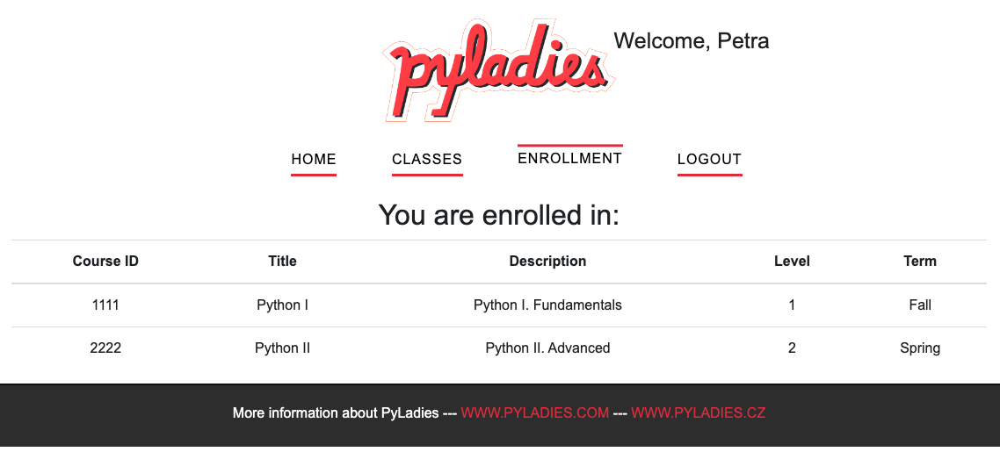

# Flask web app study project
This project was created as Flask study project. Main goal was to learn the Flask and some of its extensions and to create simple web application. Pretty code was not priority. The author is aware that many parts are missing (like logging, tests, ...).

The app was created based on this LinkedIn course [Full Stack Web Development with Flask](https://www.linkedin.com/learning-login/share?account=2056732&forceAccount=false&redirect=https%3A%2F%2Fwww.linkedin.com%2Flearning%2Ffull-stack-web-development-with-flask%3Ftrk%3Dshare_ent_url%26shareId%3D%252F8QzvinjTcmg1cBoBmP%252BVg%253D%253D).

## How to run app
1. create virtual environment (e.g. via pipenv)

    `pipenv shell`

1. install dependencies from pipfiles
   
    `pipenv install`

1. create db
   
   `flask db_create`

1. seed db (optional)
   
   `flask db_seed`

1. run app
   
   `flask run`

